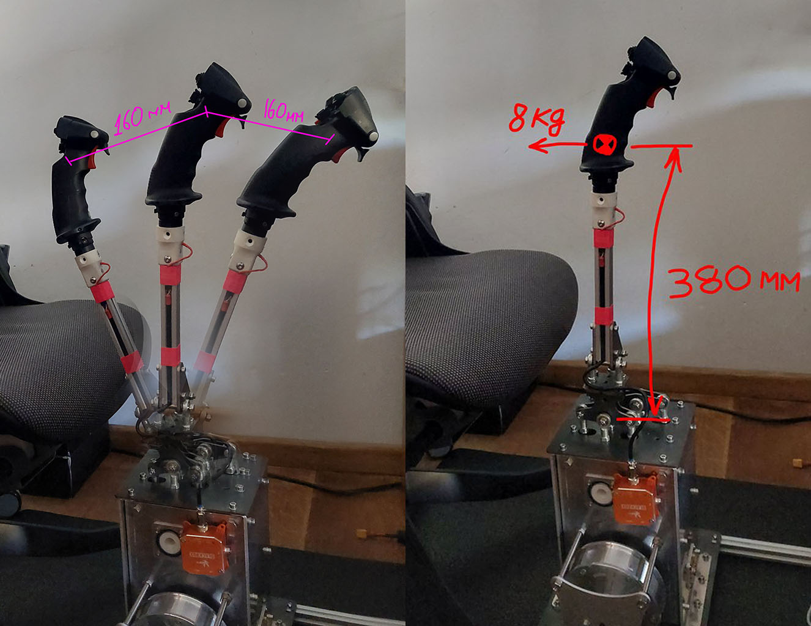

This project is all about power-full version of mechanics for DIY FFB. When utilizing strong and rigid metal construction, 
it allows to get up to 8kg force with full length stick extension with good amount of the stick deflection.

### [V1.0 version manufacturing and assembly instructions.](/v1.0/v1.0.md)

