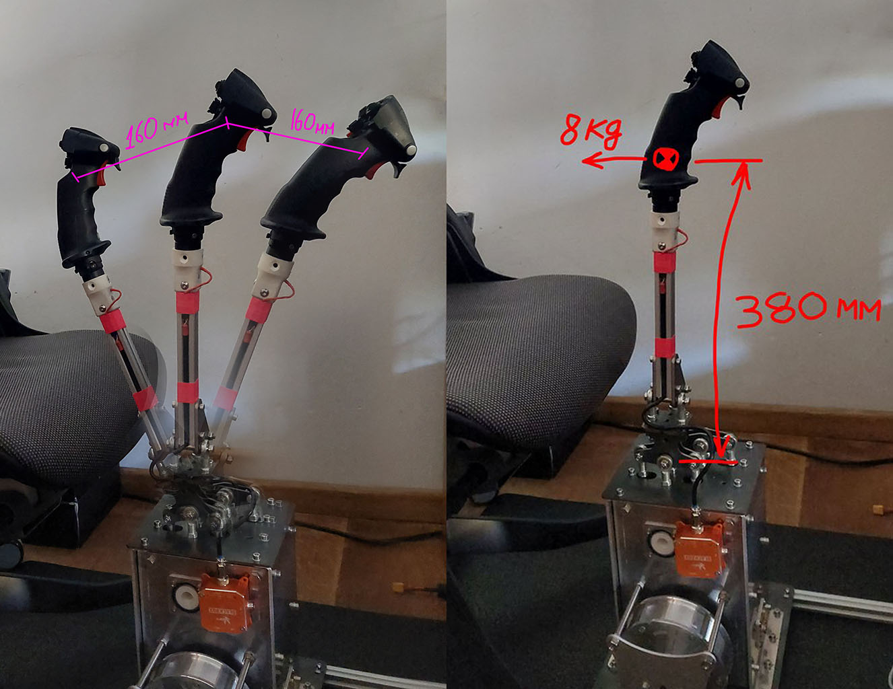
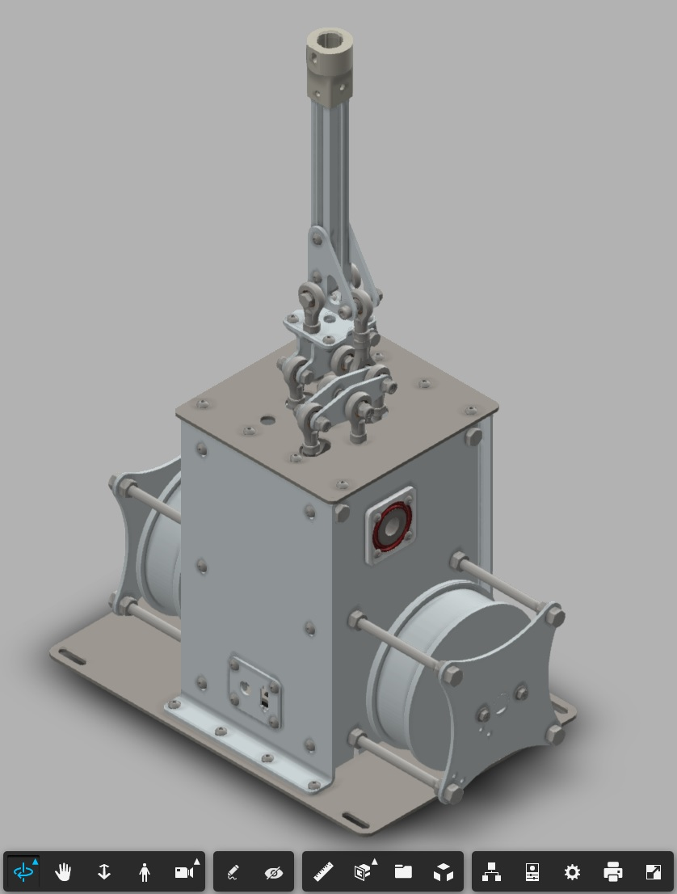

This project is all about powerfull version of mechanics for DIY FFB. When utilizing strong and rigid metal construction, 
it allows to get up to 8kg force with full length stick extension with good amount of the stick deflection.

### Manufacturing and assembly instructions
Here is **Fusion360** preview of the full assembly which you can find in the STEP folder as well.

All individual files needed for 3d printing and metal cutting and bending are already exported and are in dedicated
folders.

Please check separate pages with the  **[Components List](v1.0/components.md)** and  **[Assembly instructions](v1.0/assembly.md)** for more details.

### Electronics
This version of mechanics is not dependent on specific controller, and it can be any of your choice. As an option you can select one **[based on ODrive controller board](https://github.com/o-devices/bldc-ffb-joystick)**.

### Support Further Development
If you consider this project interesting, you can support me in my way to perfect DIY FFB for everybody :)

